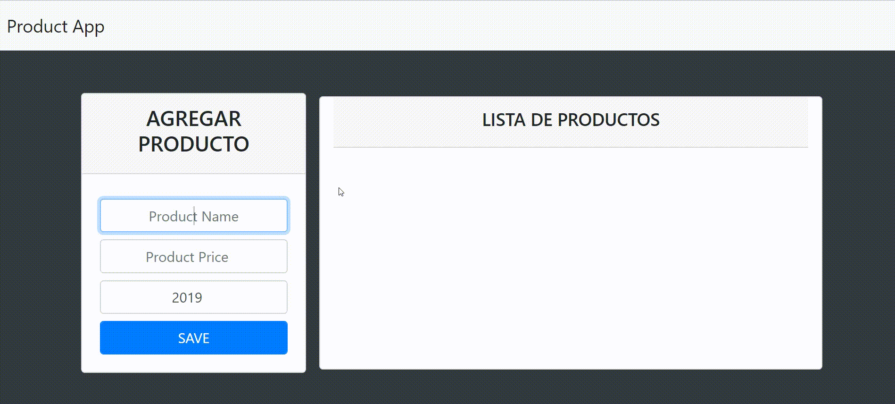

# To-do-list
>Lista de tareas, creada con clases y bootstrap para practicar habilidades con javascript.

Prueba la app : https://johanjimenex.github.io/to-do-list/

`Captura de pantalla`


```html
<!DOCTYPE html>
<html lang="es">

<head>
	<meta charset="UTF-8">
	<meta name="viewport" content="width=device-width, initial-scale=1.0">
	<meta http-equiv="X-UA-Compatible" content="ie=edge">
	<link rel="stylesheet" href="css/bootstrap.css">
	<title>Product App</title>
</head>

<body class="bg-dark">
	<!-- NAVIGATION -->
	<nav class="navbar navbar-light bg-light">
		<a href="#" class="navbar-brand">Product App</a>
	</nav>

	<div class="container col-10">
		<!-- APLICATION -->
		<div id="msg">
			<!-- Mensaje -->
		</div>

		<div id="app" class="row pt-5">

			<div class="col-md-4">
				<div class="card">
					<div class="card-header text-center">
						<h4>AGREGAR PRODUCTO</h4>
					</div>
					<form id="product-form" class="card-body">
						<input id="name" placeholder="Product Name" type="text" class="form-control my-2 text-center">
						<input id="price" placeholder="Product Price" step="0.01" type="number"
							class="form-control my-2 text-center">
						<input id="year" value="2019" min="2000" max="2019" placeholder="Product Year" type="number"
							class="form-control my-2 text-center">
						<button type="submit" class="btn btn-primary form-control">SAVE</button>
					</form>
				</div>
			</div>

			<div id="product-list" class="col-md-8 card my-1">
				<div class="card-header text-center">
					<h5>LISTA DE PRODUCTOS</h5>
				</div>
			</div>

		</div>
	</div>


	<script src="js/javascript.js"></script>
</body>

</html>
```
```javascript
var form = document.querySelector('#product-form');
var listaProductos = document.querySelector('#product-list');

class Product {
    constructor(name, price, year) {
        this.name = name;
        this.price = price;
        this.year = year;
    }
}

form.addEventListener('submit', (e) => {
    e.preventDefault();

    var name = document.querySelector('#name').value;
    var price = document.querySelector('#price').value;
    var year = document.querySelector('#year').value;

    if (name == '' || price == '' || year == '') {

        document.querySelector('#msg').innerHTML = `
            <div class='btn btn-danger col-md-12 mt-3'>
                <P>Debes llenar todos los campos</P>
            </div>
        `
        setTimeout(() => {
            document.querySelector('#msg').innerHTML ='';
        }, 2500);

    } else {

        var item = new Product(name, price, year);

        var funcion = new Funciones()

        funcion.pintarDatos(item);

        form.reset();
    }

})


class Funciones {

    pintarDatos(item) {
        
        var div = document.createElement('div');

        div.classList = 'btn my-1 d-flex justify-content-between';

        div.innerHTML = `
            <strong>Producto: </strong> ${item.name}
            <strong>Precio US$:</strong> ${item.price}
            <strong>Año de fabricación:</strong> ${item.year}
            <div>
                <button class="btn btn-primary">O</button>
                <button class="btn btn-danger">X</button>
            </div>
        `
        listaProductos.appendChild(div)
    }

    eliminarDatos(datos) {
        datos.parentElement.remove();
    }

    completar(datos) {
        datos.parentElement.parentElement.classList.toggle('btn-success');
    }
}

listaProductos.addEventListener('click', (e) => {
    e.preventDefault()

    if (e.target.innerHTML == 'X') {

        var funcion = new Funciones()

        funcion.eliminarDatos(e.target.parentElement);

        document.querySelector('#msg').innerHTML = `
            <div class='btn btn-danger col-md-12 mt-3'>
                <P>Producto eliminado de manera satisfactoria</P>
            </div>
        `
        setTimeout(() => {
            document.querySelector('#msg').remove()
        }, 3000);

    } else if (e.target.innerHTML == 'O') {

        var completar = new Funciones();

        completar.completar(e.target);
    }

})
```